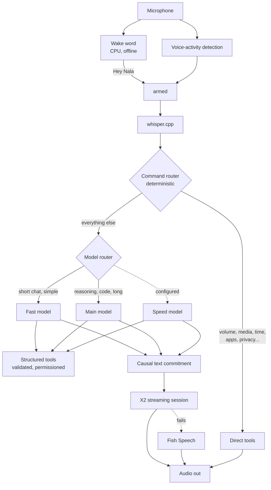

# The voice pipeline



Wake word, then voice-activity detection, then whisper.cpp, then the command
router, then (only if the router did not handle it) a model, then tools, then
the voice. Each stage is optional and reports itself missing rather than
failing.

## Wake word

Offline, on the CPU (about 1% of one core), trained on your own voice for any
phrase, and paused while she speaks. Nothing is sent to a model until it fires.
See [WAKEWORD.md](WAKEWORD.md).

| Concept | Setting | Default |
| --- | --- | --- |
| assistant name | `identity.name` | `Nala` |
| wake phrase(s) | `wake.phrases` | `["hey nala"]` |
| sensitivity | `wake.sensitivity` | `0.5` |
| wake model | trained per phrase (`nala wakeword train`) | none until trained |

Push-to-talk instead: `nala --ptt` (or `nala listen`), bound to a key such as
`bind = SUPER, N, exec, nala --ptt`. It works in every mode, and is the easiest
way to debug the rest of the pipeline.

## Speech recognition

whisper.cpp, through a warm `whisper-server` on `127.0.0.1:8178`
(`stt.serverUrl`), falling back to `whisper-cli` if the server is down.
`nala stt status` says which.

## Commands come first

Before any model is asked, the command router handles what it can in
microseconds. "Nala, pause." pauses the media player immediately; there is no
model call and, if you prefer (`tts.confirmCommands = false`), no spoken
"Paused." either. See [tools.md](tools.md).

## The model, and speaking while it writes

`SentenceStream` now commits complete clauses or safe word boundaries on a
configurable deadline. Sentences remain a conservative mode. Unfinished words,
URLs, abbreviations, numbers, open code fences and Markdown syntax are held or
sanitized. The existing ThinkFilter removes reasoning before commitment.

`auto` selects X2Streaming-TTS then Fish Speech. X2 consumes committed text over
its native WebSocket protocol and returns 24 kHz mono signed 16-bit PCM while
the LLM continues generating. One logical session carries acoustic context;
physical socket reuse does not carry previous conversations into a new turn.
Stop discards text, inference and playback. A failure before PCM may use Fish;
a failure after PCM stops without replaying already spoken words.

`qwen` retains the legacy HTTP implementation for compatibility, `fish` selects
the fallback alone and `none` is intentional silence. Legacy Qwen endpoints and
model IDs are preserved. See [tts-streaming.md](tts-streaming.md) for installation,
settings, measurements and limitations.

## Latency

Every request is timed, always. `nala latency` prints the last one;
`developer.debug` prints each as it happens. The layout, with illustrative
numbers:

```
Nala latency

STT: 372 ms
Routing: 12 ms
LLM first token: 241 ms
LLM full response: 610 ms
TTS first audio: 180 ms

Total perceived latency: 805 ms
```

Stages include STT, routing, model first token/full response, first text commit,
X2 session start, first PCM, synthesis completion and output underruns. Commit,
session, PCM and completion are elapsed since request handling starts. PCM is
measured at Qt output submission, not at the physical speaker; device buffering
adds latency. The silent benchmark does not measure output underruns or physical
sound. If PCM is available, perceived timing uses that single elapsed value to
avoid adding overlapping synthesis/model stages. See [tts-streaming.md](tts-streaming.md).

## Fitting it in VRAM

Whisper runs on the CPU by default (`stt.gpu` off keeps it there). Nala
unloads other models before loading one that would not fit
([models.md](models.md#the-gpu)). The text-to-speech server is a separate
process that Nala does not control; on a 24 GB card that also holds a 27B model,
run it on the CPU or a small model, or leave the main model's context at the
default. `nala model status` shows what is loaded and how much of it is on the GPU.
