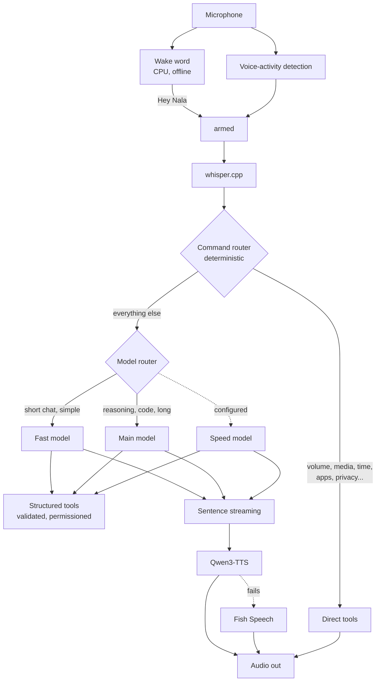

# The voice pipeline



Wake word, then voice-activity detection, then whisper.cpp, then the command
router, then (only if the router did not handle it) a model, then tools, then
the voice. Each stage is optional and reports itself missing rather than
failing.

## Wake word

Offline, on the CPU (about 1% of one core), trained on your own voice for any
phrase, and paused while she speaks. Nothing is sent to a model until it fires.
See [WAKEWORD.md](WAKEWORD.md).

| Concept | Setting | Default |
| --- | --- | --- |
| assistant name | `identity.name` | `Nala` |
| wake phrase(s) | `wake.phrases` | `["hey nala"]` |
| sensitivity | `wake.sensitivity` | `0.5` |
| wake model | trained per phrase (`nala wakeword train`) | none until trained |

Push-to-talk instead: `nala --ptt` (or `nala listen`), bound to a key such as
`bind = SUPER, N, exec, nala --ptt`. It works in every mode, and is the easiest
way to debug the rest of the pipeline.

## Speech recognition

whisper.cpp, through a warm `whisper-server` on `127.0.0.1:8178`
(`stt.serverUrl`), falling back to `whisper-cli` if the server is down.
`nala stt status` says which.

## Commands come first

Before any model is asked, the command router handles what it can in
microseconds. "Nala, pause." pauses the media player immediately; there is no
model call and, if you prefer (`tts.confirmCommands = false`), no spoken
"Paused." either. See [tools.md](tools.md).

## The model, and speaking while it writes

The model streams its answer. Nala does **not** speak raw tokens: text is cut
into sentences, and the voice starts on the first *sentence*, never a clipped
fragment.

```
model:  "Sure. I can open Firefox for you. Would you also like me to restore your tabs?"
voice:  "Sure. I can open Firefox for you."   <- starts here, before the rest is written
        "Would you also like me to restore your tabs?"
```

Abbreviations and decimals ("Dr. Smith", "3.5", "e.g.") do not end a sentence,
markdown decoration is stripped, code blocks are not read aloud, and a run-on is
broken at a comma. **Reasoning is never spoken**: whether a server sends it as a
separate field or as `<think>` tags split across chunks, it is removed before it
reaches the voice, the bubble or the conversation history.

## The voice: Qwen3-TTS, with Fish Speech as the fallback

`tts.engine`: `auto` (default: Qwen3-TTS, then Fish Speech), `qwen`, `fish`, or
`none`.

**Qwen3-TTS** is reached through any OpenAI-compatible speech server (several
community servers for Qwen3-TTS expose this, and vLLM-Omni serves the same
route):

```
POST {tts.qwen.endpoint}/v1/audio/speech
{"model": "tts-1", "input": "...", "voice": "alloy", "response_format": "pcm", "stream": true}
```

With streaming, the reply is raw 16-bit mono PCM as it is generated. The sample
rate is not in the stream, so it is a setting (`tts.qwen.sampleRate`, 24000 for
Qwen3-TTS); a WAV reply's own header is used instead when there is one. The
defaults are `http://127.0.0.1:8880`, model `tts-1`, voice `alloy`
(`tts.qwen.endpoint`, `.model`, `.voice`); `tts.qwen.instruct` sends an optional
style prompt to servers that support one. Nala was written against these servers'
documentation and tested against a fake server; **it has not been run against a
live Qwen3-TTS server on the development machine**, which had none installed.

**Fish Speech** (`tts.endpoint`, default `http://127.0.0.1:8080`) takes over
when Qwen3-TTS is not answering. A sentence that fails before any audio has
played is retried on Fish Speech, so the reply continues without a gap; an engine
that failed is skipped for 30 seconds so later sentences do not each pay for the
timeout. If neither answers, the reply is shown in the bubble and nothing else
breaks. `nala tts status` shows both.

Command execution never waits on the voice.

## Latency

Every request is timed, always. `nala latency` prints the last one;
`developer.debug` prints each as it happens. The layout, with illustrative
numbers:

```
Nala latency

STT: 372 ms
Routing: 12 ms
LLM first token: 241 ms
LLM full response: 610 ms
TTS first audio: 180 ms

Total perceived latency: 805 ms
```

Stages: wake word, VAD (the end-of-speech window), STT, routing, LLM first
token, LLM full response, TTS first audio, and command execution. "Perceived"
adds the stages that are waited on in sequence (STT, routing, first token, first
audio), or the command's own time when no model is involved. The wake-word stage
is not reported yet: the detector's per-block time is far below a millisecond
and is not part of the wait after you finish speaking.

Measured on the development machine (RTX 4090), the 27B main model answering a
casual question with thinking off: first token 449 ms, complete answer 1.26 s,
no voice server installed. See [models.md](models.md) for the benchmark.

## Fitting it in VRAM

Whisper runs on the CPU by default (`stt.gpu` off keeps it there). Nala
unloads other models before loading one that would not fit
([models.md](models.md#the-gpu)). The text-to-speech server is a separate
process that Nala does not control; on a 24 GB card that also holds a 27B model,
run it on the CPU or a small model, or leave the main model's context at the
default. `nala model status` shows what is loaded and how much of it is on the GPU.
